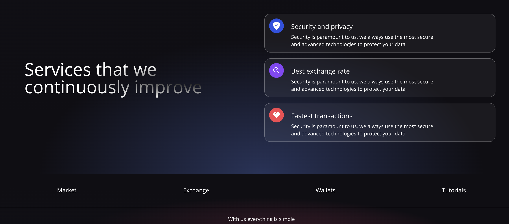

# Dapp | Milky App

This repo has been created thanks to the [Javascript Mastery](https://www.youtube.com/watch?v=Wn_Kb3MR_cU&ab_channel=JavaScriptMastery) tutorial.

It is a simple example of how to interact with MetaMask and Ethereum Testnets.

### A glance at the Milky App (A random name)
 </img>

### Services
 </img>

### Transaction preview
 </img>

### How to run the project 

1. [Client App](client)
2. [Smart Contract](smart-contract)
